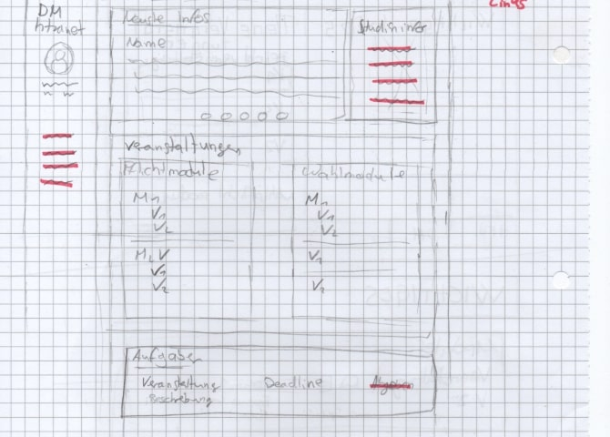
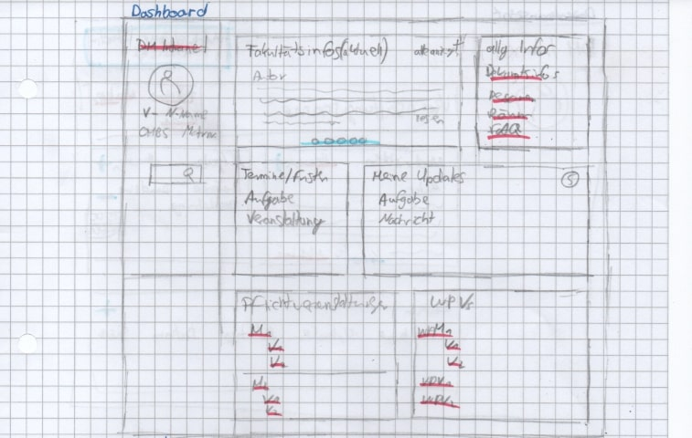

# Task 2.2 - Intranet low fid
## Vorgehen
    1. Überlegug, was im Intranet wichtig ist
    2. Verschiedene Wireframes als einfachste Scribbles erstellt
    3. Ausarbeitung der m.M.n. besten Variante
    4. Feedback eingeholt
    5. Prototyping

## 1. Wichtige Elemente Im Intranat
### 1.2. Dashboard
- Aktuelle Informationen der Fakultät und Hochschule
- Termine und Fristen (Aufgaben, Versanstaltungen [z.B Tag der Medien], ...)
- Gebuchte Veranstaltungen. Untereteilt in Pflicht- und Wahlpflichtveranstaltungen
- Updates innerhalb der Veranstaltungen (neue Dateien, Nachrichten und Aufgaben). Klick auf das Update bringt einen direkt zu dem Update. Das erspart langwierige Suche nach z.B. neuer Datei in überfüllten Dateiverzeichnissen.

### 1.2. Veranstaltungsansicht für Studierende
- Name und Titel des Dozenten inkl. Mail-Adresse
- Prüfungsart (Klausur, Hausarbeit, ...) mit ECTS
- Kursinfos
- Teilnehmer
- Aktuelle Kursinformetionen
- Aktuelle Aufgaben
- Dateien

### 1.3. Veranstaltungsseite für Lehrende
- Teilnehmerzahl und Teilnehmerliste
- Kursiofos (editierbar)
- Teilnehmer (editierbar)
- Aktuelle Kursinformetionen(editierbar)
- Aktuelle Aufgaben (editierbar)
- Dateien (editierbar)
- Wechsel zwischen Studierendenansicht und Lehrendenansicht, um änderungen zu prüfen

## 2. Erste Scribbles
**Scribble 1**

**Scribble 2**

**Scribble 3**

## 3. Ausarebeitung der Besten Version
**Dashboard**

**Sudierendenansicht**

**Lehrendenansicht**

## 4. Feedback
In diesem Schritt habe ich mir Feedback eingeholt, um meine erste Version verbessern zu können. Das Feedback sah wiefolgt aus:
- Menü/Seitenleiste soll nicht immer zu sehen sein

## 5. Prototyping
Nun habe ich das Feedback eingearbeitet und eine Reinzeichnung der Scribbles gemacht. Dabei habe ich möglichst viele potenziellen Unterseiten beachtet.

*Legende*
-  Klickbarer Text
-  Input Felder
-  Buttons

**Dashboard**

**Menu**

  

**Studierendenansicht**

  

**Studierendenansicht**

  

**Studierendenansicht**

  

**Studierendenansicht**

  

