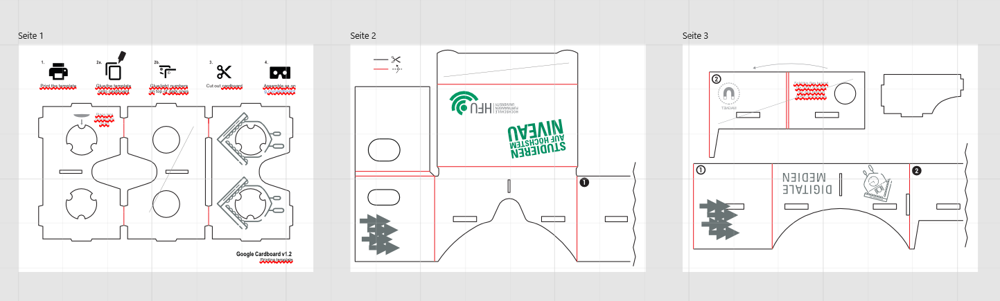

# Task 08 - Mxed Reality - Cardboard Brille
## 1. Designen
Mithilfe eines Designtools, habe ich zunächst ein Design für die Cardboard Brille erstellt.

## 2. Kleben
Zum Kleben habe ich Tapennkleister verwendet.
.jpg)
.jpg)

## 3. Ausschneiden
Zum Ausschneiden habe ich einen Cutter benutzt
.jpg)
.jpg)

## 4. Falten
Damit die fertige Brille zusammenält habe ich Tesafilm und durchsuchtige Klammern verwendet.

## 5. Ergebnis
.jpg)
.jpg)
.jpg)

## 6. Testen
Zum Testen habe ich verschiede YouTube Videos und die Google Cardboard App benutzt. 
