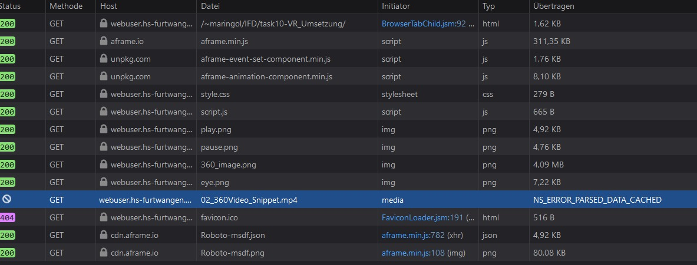

# Task 10 - Mixed Ralitiy - Umsetzung

Ich habe mich bei der Umsetzung auf einen einminutigen Clip der Gesprächsrunde entschieden. Um diese nun real interaktiv zu machen, habe ich die an der Tafel angepinnten Notizen interaktiv gemacht und einen Play-Pause-Button eingefügt.

## 1. Inhalt
1. Inhalt
2. Technologie bzw. Basis der Umsetzung
3. Porbleme
4. Screencast und Download

## 2. Technologie bzw. Basis der Umsetzung
Bei der Umsetzung habe ich mir für das web-basierte [A-Frame](https://aframe.io/) entschieden.  
Dieses ist kleicht zu lernen und schenll umzusetzen. Man muss alle Elemente nur in HTML mittels Attributen definieren. CSS habe ich keines verwendet. Zusätzlich habe ich eine JS-Datei benutzt, um Elemente anhand der aktuellen Zeit den Videos anzeigen zu können.  

Durch die große Community und die gute Dokumentation können (fast) alle Fragen beantwortet werden.

Zusätzlich ist es **kostenlos** zu nutzen. Man benötig lediglich einen Server, auf welchem Scripte ausgeführt werden können.

Außerdem bietet A-Frame einen Webeditor. Hierzu muss man lediglich eine HTML-Datei mit einem *a-scene* bestücken und diese auf einen Server laden.  
Nun ruft man die Website auf und drückt die Tastenkombination _Strg+Alt*i_. Hier können nun alle Elemente platziert und mit den gewünschten Attributen erstellt werden.

## 3. Probleme
### 3.1. Der richtige Browser
Da ich normalerweise mit dem auf Chromium basierten Edge Browser arbeite, habe ich diesen auch hierzu zum Entwickeln vwerwendet. Leider hat sich dieser nicht gut zum Entwickeln herausgestellt.  
Wenn ich etwas im Code verändert habe und die Seite neu geladen haben (der Cahce wurde geleert) gab es irgendwelche Komplikationen, sodass dich die Anwendung nicht mehr steuern lies.  
Dies geschah aber nur manchmal. Das selbe galt bei mir auch für Chrome.

Bei Firefox hat dies dann Problemlos funktionert.

### 3.2. Serverproblem
Sowhol der bei Github als auch beim HFU-Webspace tritt das Problem auf, dass sich die Anwendung nicht richtig starten lässt. Ich habe die Website auch mit mehreren Browsern erfolglos aufgerufen. 

**Das Problem**  
Das Video wird gefunden und erkannt. Es wird aber nicht in der der A-Frame-Scene abgespielt. Schaut man sich in den Developer-Tools des Browsers um, so kommt folgende Fehlermeldung. 

Leider konnte ich diese nicht beheben. Dadurch ist mein Prototyp online nicht nutzbar.

## 4. Screencast und Download
Aus dem Soeben genannten Problem, kann der Prototyp leider nicht online abgerufen werden. Deshab habe ich einen Screencast erstellt und die Files als ZIP-File zum Download bereitgestellt.

<video width="320" height="240" controls>
  <source src="Screencast.mp4" type="video/mp4">
</video>

